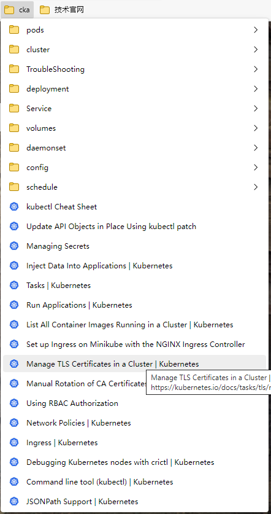
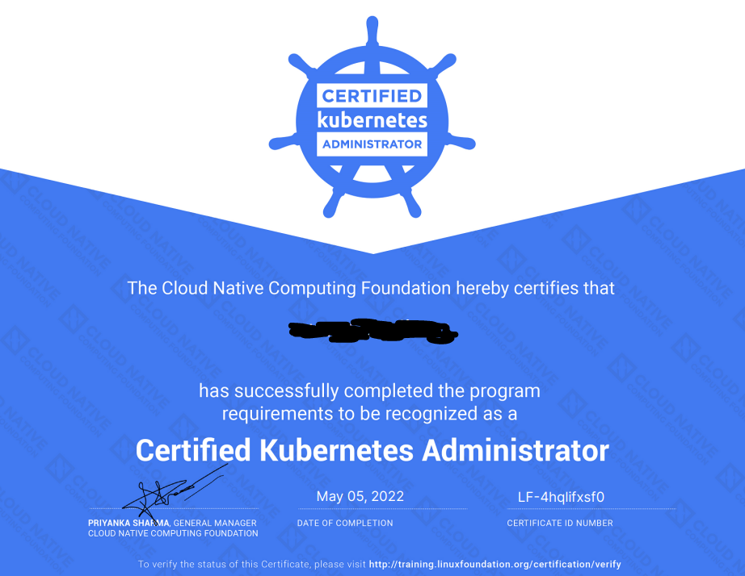

> CKA即Certified Kubernetes Administrator，是由Linux开源基金会主办的kubernetes官方认证。除了CKA，还有CKS、CKAD。题主本人是五一假期的时候考过的，下面是一些心得分享，与君共勉。

### 考试购买

CKA原价是￥2498，购买链接([Kubernetes 管理员认证 (CKA) (linuxfoundation.cn)](https://training.linuxfoundation.cn/certificate/details/1))，一般官网会给一个优惠，但是优惠力度非常小。每年的黑色星期五，也就是感恩节第二天开始的一周，会有比较大的优惠。题主是2021年黑色星期五买的，花费了￥1498，如果你不着急报名，可以等黑色星期五优惠时再购买。

从购买当天算起，一年内须考试通过，否则资格就废弃了。如果第一次没考过，还有一次补考机会，补考过了同样会认证通过。

考试购买后会附带一份模拟题，模拟题可以练习两次，但是每次练习只给36小时。也就是说，在你开始模拟后，36小时内可以重复模拟多次，但是过了36小时后，入口就关闭了。模拟题难度远大于真题，供参考即可。如果模拟考试时间不够或者不想模拟，可以直接跳转到答案页面，然后ctrl+s将整个页面保存到本地，这样会把题目和答案均保存下来，后续可以离线查看。

### 考纲

考纲可以在这个页面[Kubernetes 管理员认证 (CKA) (linuxfoundation.cn)](https://training.linuxfoundation.cn/certificate/details/1)查看，主要有以下内容。

**集群架构，安装和配置：25%**

• 管理基于角色的访问控制（RBAC）

• 使用Kubeadm安装基本集群

• 管理高可用性的Kubernetes集群

• 设置基础架构以部署Kubernetes集群

• 使用Kubeadm在Kubernetes集群上执行版本升级

• 实施etcd备份和还原

**工作负载和调度：15%**

• 了解部署以及如何执行滚动更新和回滚

• 使用ConfigMaps和Secrets配置应用程序

• 了解如何扩展应用程序

• 了解用于创建健壮的、自修复的应用程序部署的原语

• 了解资源限制如何影响Pod调度

• 了解清单管理和通用模板工具

**服务和网络：20%**

• 了解集群节点上的主机网络配置

• 理解Pods之间的连通性

• 了解ClusterIP、NodePort、LoadBalancer服务类型和端点

• 了解如何使用入口控制器和入口资源

• 了解如何配置和使用CoreDNS

• 选择适当的容器网络接口插件

**存储：10%**

• 了解存储类、持久卷

• 了解卷模式、访问模式和卷回收策略

• 理解持久容量声明原语

• 了解如何配置具有持久性存储的应用程序

**故障排除：30%**

• 评估集群和节点日志

• 了解如何监视应用程序

• 管理容器标准输出和标准错误日志

• 解决应用程序故障

• 对群集组件故障进行故障排除

• 排除网络故障

### 备考思路

考试前肯定是尽可能要把所有的考点都学习透彻，这样才不会怯场。

题主的学习路线如下：

#### 参考博客

[从 Docker 到 Kubernetes 进阶手册 (qikqiak.com)](https://www.qikqiak.com/k8s-book/)，阳明的这份博客从docker到k8s讲解很清晰，且上手难度小，跟着练习即可掌握k8s大部分资源对象。

**注：题主不是在打广告，纯分享心得。**

#### Udemy课程跟练

之前在知乎上看到有人推荐这个课程，个人感觉比较便宜，就购买了一份。链接[CKA](https://www.udemy.com/share/101Xtg3@TZlPE_RM8e1BpSEgctFWwCYN8-Z034U58ycsRtDQkJDQL94dCs1PZLphoU636FJEqw==/)，Udemy上面经常有打折，题主当时是$14买的，如果你看到价格比较贵，过几天再来看看可能就会有打折。这个课程是全英文教学的，有英文字幕，但是字幕是根据教师的口音自动翻译过来的，经常会有翻译不准的问题，比如Pod翻译成pad等等。总体来说使用的都是简单的词语，CET4过了就没有什么听力障碍。这个课程最大的特点是附带一份随堂练习，每节课后基本上都有一个小练习，和CKA真题难度类似。此外还有一份模拟题，如果模拟题基本都可以真确解答，考试基本上是没问题的。

 **注：题主不是在打广告，纯分享心得。**

#### 书籍参考

之前公司发了一张购书券，刚好我在学习kubernetes，于是就买了一本马哥的《kubernetes进阶实战》。这本书对新手来说难度较大，如果目前你处于新手阶段，建议仅做参考。

### 刷题训练

题主分享一些题供诸位参考，

#### CKA附带模拟题

链接：https://pan.baidu.com/s/1UYelPkS_Mlb0kvK5uwGbVA 
提取码：tfpl

#### 与题主本人考试相近的题目

链接：https://pan.baidu.com/s/1l6_kyZDcB1sNnIpJBYIUog 
提取码：g4nn

#### 其他参考题

链接：https://pan.baidu.com/s/1g-SYdPc6dJJ8YnZ9vu848g 
提取码：hdpc

#### github上一些练习命令

[Github参考练习](https://github.com/dgkanatsios/CKAD-exercises)

#### 其他网站参考练习

https://killercoda.com/killer-shell-cka

### TIPS

1、考试需要科学上网，否则考前的环境检查通过不了。

2、考试一共17道题，不是官网所说的25道题，认真准备的话时间完全充裕。

3、尽量报考CKA-CN，这样考官也是发送中文信息，看起来较为方便。

4、准备一张带有英文名字的证件，如护照、港澳台通行证、信用卡等等，**证件上的名字需要与报考时填写的名字一致**。题主考试时使用了一张运通信用卡和身份证。

5、考前需要准备好摄像头，房间打扫干净，墙壁上不能张贴海报、字画等。

6、考试时如果哪个题不会写，先用notepad记录一下，这样后面写完了回头看时，就可以直接跳转到对应的题目，不用一个个翻。

7、复制键是ctrl+insert，粘贴可以点右键选择粘贴也可以shift+insert。

8、建议将常用的官方文档页面放到固定的收藏夹，这样可以随时跳转过去，节省查找时间。

9、证书为电子证书，如下。

10、如有疑问，可以联系我共同探讨哦~QQ：992842818